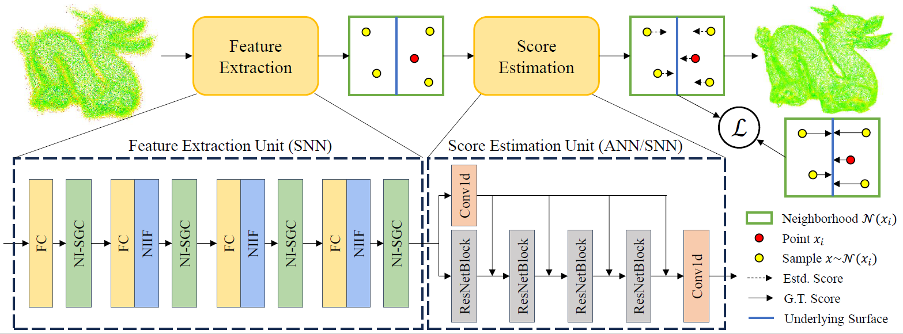

# NI-SGCN: Noise-Injected Spiking Graph Convolution for Energy-Efficient 3D Point Cloud Denoising (AAAI‘25)
We design noise-injected spiking graph convolutional networks (NI-SGCN) for 3D point cloud denoising, which is based on an ANN-based denoising architecture, ScoreDenoise. The NI-SGCN consists of two main parts: the spiking feature extraction module and the score estimation module.



Consequently, we propose two implementations of NI-SGCN: the first is a hybrid architecture, NI-HSGCN, witch employs the above spiking feature extraction module and the ANN-based score estimation module; the second is NI-PSGCN, a purely SNN-based structure, which fully leverages the enhanced energy efficiency of SNNs.

## Environment

- Python 3.8
- PyTorch 2.1.2
- CUDA and CuDNN (CUDA 11.8 & CuDNN 8.7)
- [point_cloud_utils](https://github.com/fwilliams/point-cloud-utils)  0.30.4
  - For evaluation only. It loads meshes to compute point-to-mesh distances.
-  [pytorch3d](https://github.com/facebookresearch/pytorch3d) 0.7.5
  - For evaluation only. It computes point-to-mesh distances. 
-  [pytorch-cluster](https://github.com/rusty1s/pytorch_cluster)  1.6.3
  - We only use `fps` (farthest point sampling) to merge denoised patches.
- [spikingjelly](https://github.com/fangwei123456/spikingjelly) 0.0.0.0.14
- other:
  - tqdm 
  - scipy 
  - scikit-learn 
  - pyyaml 
  - easydict 
  - tensorboard 
  - pandas

## Datasets

Download link: https://drive.google.com/drive/folders/1--MvLnP7dsBgBZiu46H0S32Y1eBa_j6P?usp=sharing

Please extract `data.zip` to `data` folder.

## Train

### Training of NI_HSGCN

```bash
cd models_NI_HSGCN
bash train_snn_Noisy.sh NI-HSGCN-T4 4
```

workspace=NI-HSGCN-T4   

time step t=4

Please find tunable parameters in the script.

### Training of NI_PSGCN

```bash
cd models_NI_PSGCN
bash train_snn_Noisy.sh NI-PSGCN-T4 4
```

Please find tunable parameters in the script.

## Denoise-test

```bash
# PCNet dataset, 10K Points, 0.01 noise, niters 1, T 4
cd models_NI_HSGCN
bash test_snn.sh NI-HSGCN-T4 ../Exp/NI-HSGCN-T4/checkpoint/ckpt_0.000361_974000.pt PCNet 10000_poisson 0.01 1 4
```

Please find tunable parameters in the script.

### Test sequence

```bash
cd models_NI_HSGCN
bash seq_test_IF_T4.sh
```

## Citation

If you find this repo useful, please consider citing:

```

```

## Acknowledgements

This code largely benefits from following repositories:

- [ScoreDenoise](https://github.com/luost26/score-denoise)
- [spikingjelly](https://github.com/fangwei123456/spikingjelly)